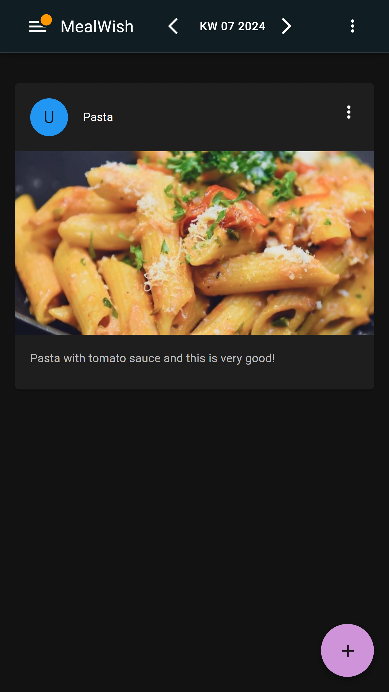

# MealWish

> [!WARNING]  
> This is in beta now and should not be used in production.

The idea behind **MealWish** is to provide a tool to manage your meal wishes and your meals. 
Each member can choose from a list of what he or she would like to eat for the next few weeks. 
The chef or the household can then decide which dishes he or she will cook in the
following days. Users can see the plan in the overview, and members who are responsible for 
shopping can also plan what they have to buy.




## Requirement

MealWish is a REACT application wrapped in a web component that seamlessly integrates with
HomeAssistant and gets updates like the current user. The database (backend) needs to be
installed separately. You can also install the backend as a HomeAssistant add-on.

## Installation

### Precondition

You need to clone the repository and install the dependencies:

```bash
git clone https://github.com/0x7878/MealWish.git
```

Change the api URL in frontend/src/config.tsx.

Now you can build the frontend and the backend:

``` bash
cd MealWish/frontend
npm install
npm run build

cd ../backend
npm install
npm run build
```

### HomeAssistant Add-on

The easiest way to install MealWish is to use the HomeAssistant add-on. You install the
add-on by adding the following files in your HomeAssistant installation:

Folder structure in HomeAssistant:
```plaintext
/
  /addon_configs
    /local_mealwish-api
      /uploads
      /db.json
  /addons
    /meal-wish-api
      /config.yaml
      /Dockerfile
      /package.json
      /package-lock.json
      /src
        /index.js
```

The content of the `config.yaml` file:

```yaml
name: "MealWishAPI"
description: "API for the MealWish Webcomponent"
version: "1.0.0"
slug: "mealwish-api"
init: false
arch:
  - aarch64
  - amd64
  - armhf
  - armv7
  - i386
startup: services
map:
  - addon_config:rw
ports:
  3000/tcp: 3000
```

The content of the `Dockerfile` file:

```Dockerfile
ARG BUILD_FROM
FROM $BUILD_FROM

RUN apk add --no-cache nodejs npm
WORKDIR /usr/src/app

COPY package*.json ./
RUN npm install --production

COPY . .
EXPOSE 3000

CMD ["node", "src/server.js"]
```
Please upload the db.json, package.json, package-lock.json, and src/index.js files accordingly.

Restart HomeAssistant and install the add-on from the Supervisor panel.

For more Infos see step2 in the [Installation Guide](https://developers.home-assistant.io/docs/add-ons/tutorial/).

### Frontend

copy the main[RANDOM].js file from the frontend/build/static/js folder to your HomeAssistant /config/www folder.

In your HomeAssistant configuration.yaml file add the following lines:

```yaml
panel_custom:
  - name: meal-wish
    sidebar_title: Meal Wish
    sidebar_icon: mdi:silverware-variant
    url_path: mealwish
    module_url: /local/main.f50a203d.js
```

Restart HomeAssistant and you should see the MealWish web component in the sidebar.